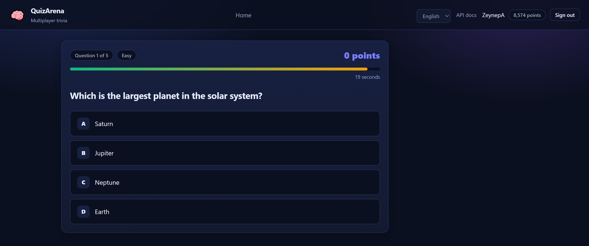
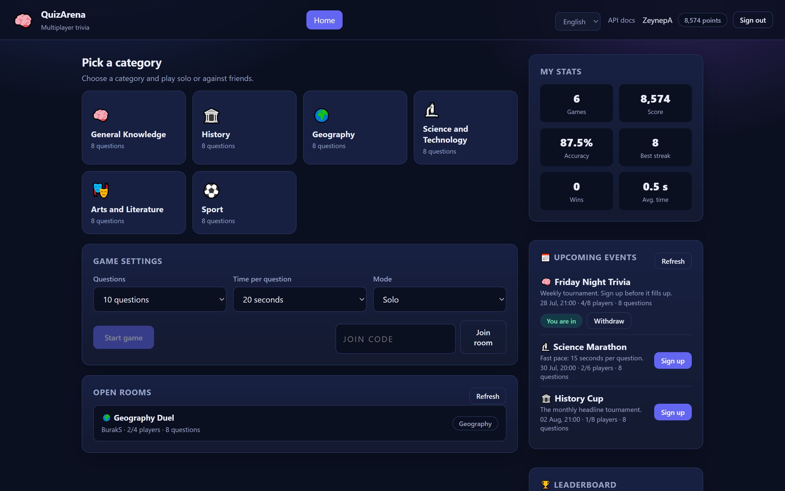
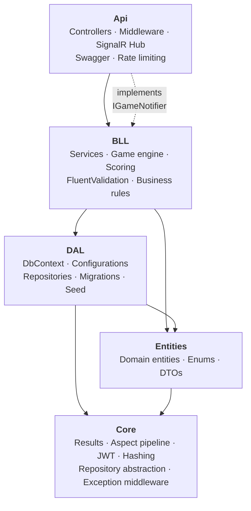
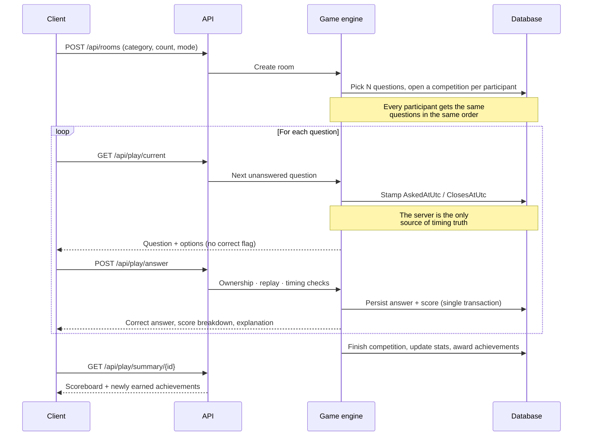
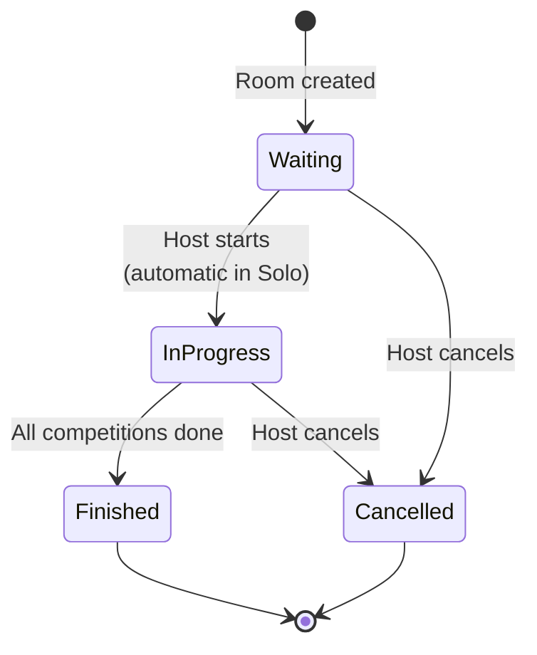
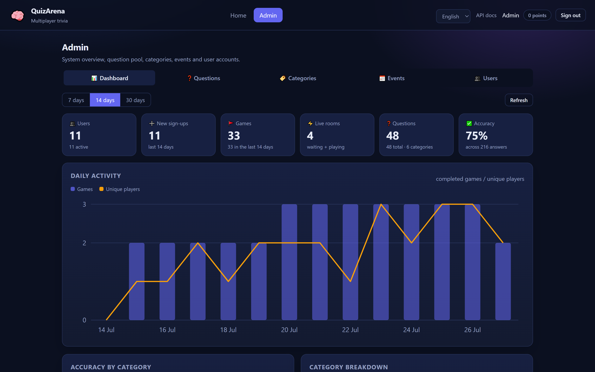
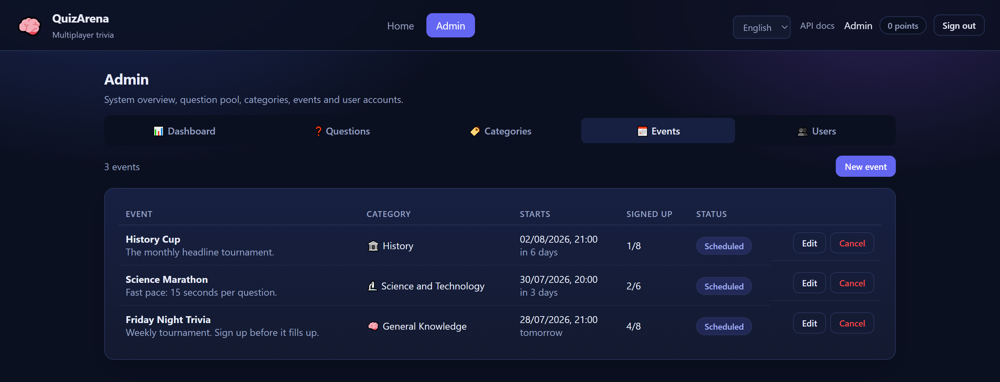

<div align="center">

# 🧠 QuizArena

**A multiplayer quiz platform built on a layered .NET 8 architecture.**

Real-time rooms · server-authoritative scoring · cheat-resistant by design

[](https://dotnet.microsoft.com/)
[](https://learn.microsoft.com/ef/core/)
[](https://www.microsoft.com/sql-server)
[](https://learn.microsoft.com/aspnet/core/signalr/)
[](#testing)
[](#)
[](LICENSE)

**English** · [Türkçe](README.tr.md)

</div>

---

<div align="center">
  
</div>

**A trivia game you can run with one command.** Clone it, `dotnet run`, and you
are playing in the browser — no npm, no build step, no CDN. The playable client
ships inside `wwwroot` as plain HTML, CSS and JavaScript.

What makes it worth reading:

- **The correct answer never reaches the browser.** Not in the question payload,
  not in a hidden field, not in a second endpoint. It arrives only after you
  have answered.
- **The server owns the clock.** Elapsed time is measured where the question was
  issued, so a paused tab or an edited system clock earns nothing.
- **Scoring rewards speed and difficulty**, and the whole formula is a pure
  function with its own test suite — every boundary covered.

<div align="center">
  
</div>

> Screenshots come from the bundled demo seed running in English, so the
> numbers are sample data.
> Every hardening decision below is documented with the attack it closes, not
> just the setting it changes — see the [security section](#security).

---

## Table of contents

- [Quick start](#quick-start)
- [Architecture](#architecture)
- [Game flow](#game-flow)
- [Admin console](#admin-console)
- [Security](#security)
- [Two languages](#two-languages-one-bundle)
- [Scoring](#scoring)
- [API reference](#api-reference)
- [Testing](#testing)
- [Configuration](#configuration)
- [Docker](#docker)
- [Engineering decisions](#engineering-decisions)
- [Project layout](#project-layout)

---

## Quick start

**Requirements:** .NET 8 SDK and any SQL Server instance
(LocalDB, SQL Express, or Docker).

```bash
git clone https://github.com/kbycode/QuizArena.git
cd QuizArena/QuizArena
```

The JWT signing key is **never stored in source control**. Set it once:

```bash
dotnet user-secrets set "TokenOptions:SecurityKey" "a-random-key-of-at-least-32-characters" --project QuizArena.Api
```

Then run:

```bash
dotnet run --project QuizArena.Api --launch-profile http
```

On first start the app creates the schema and seeds **6 categories with 48
questions**, 4 permission claims, 6 achievements, and sample players for the
leaderboard.

| URL | What you get |
|---|---|
| <http://localhost:5219> | Playable demo client |
| <http://localhost:5219/swagger> | Interactive API docs |
| <http://localhost:5219/health/ready> | Readiness probe |

> **Admin account.** If `Seed:AdminPassword` is not supplied, a random password
> is generated and written to the startup log **once** — in Development only.
> In Production, a missing password means the admin account is **not created at
> all**. Shipping with a guessable admin password is structurally impossible.

---

## Architecture

Dependencies flow in **one direction**. No lower layer knows about a higher one.



| Layer | Owns | **Deliberately does not know** |
|---|---|---|
| **Core** | Result types, AOP, security, paging, error handling | Quizzes, rooms, questions — no business concept at all |
| **Entities** | The domain model | Databases, HTTP, JSON |
| **DAL** | *How* data is stored | Business rules |
| **BLL** | *What the rules are* — the brain | HTTP, JSON, SignalR |
| **Api** | *How it is exposed* | SQL, indexes, migrations |

### The boundary worth looking at: `IGameNotifier`

Real-time updates run over SignalR, yet the business layer has **never heard of
SignalR**. `BLL` depends only on the `IGameNotifier` interface; the SignalR
implementation lives in the API layer. Three concrete payoffs:

1. Unit tests need no `IHubContext` mock — a `NullGameNotifier` suffices.
2. Swapping the transport (Web Push, a message queue) touches zero business code.
3. If no notifier is registered at all, the game still runs correctly.

*The Dependency Inversion Principle doing real work, not decoration.*

---

## Game flow



### Room lifecycle



---

## Admin console

Sign in as an administrator and the top bar gains an **Admin** entry: five
tabs, each gated by its own permission. The route guard only answers "may this
user open the console"; which tabs appear is decided per tab, and every one of
those permissions is enforced again in the business layer, so hiding a tab is a
courtesy rather than the boundary.

<div align="center">
  
</div>

| Tab | Permission | What it does |
|---|---|---|
| **Dashboard** | `Admin` | One aggregate endpoint feeds six KPI tiles, a daily-activity chart, per-category accuracy and the ten most-missed questions |
| **Questions** | `Admin`, `Question.Manage` | CRUD over the question pool, with an answer editor that enforces exactly one correct option |
| **Categories** | `Admin`, `Category.Manage` | Create and edit categories, toggle visibility |
| **Events** | `Admin`, `Event.Manage` | Schedule tournaments that start **on their own** |
| **Users** | `Admin`, `User.Manage` | Server-side paged list with search, enable/disable, lockout release, permission assignment |

**The charts are hand-written SVG.** A charting library would have to come from
npm or a CDN — either one ends the "clone and `dotnet run`" promise and breaks
the strict Content-Security-Policy header. A few hundred bytes of generated
`<rect>` and `<polyline>` cost less and give exact control.

### Scheduled events

An event is not a separate entity — it is a `Room` with `IsOfficialEvent` and
`ScheduledStartUtc` set, so question selection, per-player competitions, the
scoreboard and scoring are reused rather than duplicated.

A `BackgroundService` polls every 30 seconds, starts events whose minute has
arrived, and cancels those nobody signed up for. There is deliberately **no
endpoint that starts an event early**: the announced time is the whole point.
Registering also does not count as "being in a room", so a player who signs up
for Friday's tournament can still play today.

<div align="center">
  
</div>

---

## Two languages, one bundle

The interface ships in **English and Turkish**, and picks the right one from the
browser on first visit (`navigator.language`); the selector in the top bar
overrides it and the choice is remembered.

There is no build step and no second bundle: `wwwroot/i18n.js` holds both
dictionaries, `t('key')` resolves the current one, and static markup is filled
from `data-i18n` attributes. Switching redraws the open screen in place.

**Server messages follow the interface.** Every request carries
`Accept-Language`, ASP.NET Core's request localisation sets
`CurrentUICulture`, and validation and business-rule messages come back in the
same language — so an English screen never shows a Turkish error. The message
tables live in `QuizArena.Core/Localization`, and a test fails the build if the
two tables ever drift apart.

**The question pool is localised too.** `Seed:ContentLanguage` selects the seed
set, so an English install starts with English categories, questions and
achievements rather than translated Turkish ones.

---

## Security

Security here is not a layer bolted on afterwards — it is a set of constraints
designed together with the data model.

### The correct answer never reaches the client

The DTOs used to serve a question (`QuizQuestionResponse`, `QuizOptionResponse`)
have **no field for correctness**. It was not stripped at runtime; it was never
declared. Return the wrong DTO in the wrong place and **the code does not
compile**. The answer is revealed only after the player commits, through
`AnswerResultResponse`.

*The alternative — one DTO plus an `if` to hide the field — can be forgotten.
A type error cannot.*

### The server measures time

`POST /api/play/answer` has **no "elapsed time" field**. The server stamps the
moment it served the question and computes the duration itself. A 1.5-second
tolerance absorbs network latency without granting a meaningful advantage.

### The rules that matter live in database constraints

Application-level `if` checks lose to race conditions: two requests arriving in
the same microsecond both see "not found" and both insert. A unique index does
not lose.

| Constraint | Attack it defeats |
|---|---|
| `CompetitionAnswers.CompetitionQuestionId` **unique** | Submitting a second answer to double the score |
| `(CompetitionId, QuestionId)` **unique** | The same question appearing twice in one game |
| `(RoomId, UserId)` **unique** | One player occupying two seats |
| `Users.NormalizedEmail` **unique** | The check-then-insert race on registration |
| `(UserId, AchievementId)` **unique** | Farming an achievement's bonus repeatedly |

### Authentication

- **PBKDF2-HMAC-SHA256**, 600 000 iterations (OWASP 2023), random salt, with the
  parameters embedded in the hash — the iteration count can be raised years
  later and existing users are silently re-hashed on their next login.
- Constant-time comparison via `CryptographicOperations.FixedTimeEquals`.
- Verification cost is paid **even when the user does not exist**, so response
  time cannot reveal whether an account is registered.
- 15-minute access tokens plus **rotating** refresh tokens. Reusing a revoked
  token is treated as theft and drops **every** session for that user.
- Refresh tokens are stored as **SHA-256 digests**, never in plaintext.
- Account lockout after 5 failed attempts, plus a separate and stricter rate
  limit on authentication endpoints.

### Defense in depth for authorization

Business methods carry `[SecuredOperationAspect(...)]` in addition to
`[Authorize]` on controllers. The reason is practical: when someone later calls
the same service from a new entry point — a SignalR hub, a background job, a new
controller — and forgets the attribute, the check is still there.

### Vulnerabilities closed during the rebuild

| Severity | Issue | Impact |
|---|---|---|
| 🔴 Critical | `UsersController` returned the `User` entity directly | Every user's `passwordHash` and `passwordSalt` exposed in JSON |
| 🔴 Critical | Permission-claim endpoints had no authorization | An anonymous request could grant itself `Admin` |
| 🔴 Critical | `GET /api/answers/getall` returned `isTrue` per option | The full answer key was one request away |
| 🟠 High | Request bodies bound straight to entities | Over-posting `passwordHash` overwrote passwords |
| 🟠 High | Single-round HMAC hashing, early-exit comparison | GPU-feasible cracking, timing leak, `IndexOutOfRangeException` on length mismatch |
| 🟠 High | No refresh tokens, long-lived access tokens | Sessions effectively never expired |
| 🟠 High | Distinct "user not found" / "wrong password" messages | Account enumeration |
| 🟠 High | No brute-force protection | Unlimited password guessing |
| 🟡 Medium | No exception handling | Stack traces and connection strings leaked to clients |
| 🟡 Medium | JWT key and connection string hardcoded in `appsettings.json` | Secrets committed to source control |

---

## Scoring

```
Base      = difficulty            (Easy 100 · Medium 150 · Hard 250)
Speed     = Base × 0.5 × (fraction of time remaining)
Streak    = min(current streak, 10) × 10
──────────────────────────────────────────────────
Total     = Base + Speed + Streak   (0 if wrong or timed out)
```

`ScoreCalculator` is a **pure function** — no database, no clock, no HTTP
context. That is why every branch and boundary of the formula is covered by unit
tests, and why "it gave me a different score that time" cannot happen.

**Achievements:** First Step · Flawless · Lightning · Veteran · Streak Master · Champion

---

## API reference

| Method | Endpoint | Auth | Purpose |
|---|---|---|---|
| `POST` | `/api/auth/register` | — | Register and sign in |
| `POST` | `/api/auth/login` | — | Sign in |
| `POST` | `/api/auth/refresh` | — | Rotate tokens |
| `POST` | `/api/auth/logout` | — | Revoke a refresh token |
| `POST` | `/api/auth/change-password` | User | Change password, drop all sessions |
| `GET` | `/api/categories` | — | Categories with question counts |
| `GET` | `/api/leaderboard` | — | Global leaderboard |
| `GET` | `/api/users/me` | User | Own profile |
| `PUT` | `/api/users/me` | User | Update profile |
| `GET` | `/api/users/me/statistics` | User | Stats and achievements |
| `GET` | `/api/users` | `User.Manage` | Paged user list |
| `POST` | `/api/rooms` | User | Create a room |
| `POST` | `/api/rooms/join` | User | Join by code |
| `POST` | `/api/rooms/{id}/start` | Host | Start the game |
| `GET` | `/api/play/current` | User | Next question |
| `POST` | `/api/play/answer` | User | Submit an answer |
| `GET` | `/api/play/summary/{id}` | User | Result screen |
| `*` | `/api/questions` | `Question.Manage` | Question management |
| `*` | `/api/categories` | `Category.Manage` | Category management |
| `*` | `/api/operationclaims` | `Admin` | Permission management |

**Real-time channel:** `/hubs/quiz` — emits `RoomUpdated`, `GameStarted`,
`ScoreboardUpdated`, `GameFinished`, `RoomCancelled`.

Errors follow **RFC 7807** (`application/problem+json`) with field-level
validation details.

---

## Testing

```bash
dotnet test
```

**120 tests, all green.**

| Suite | What it proves |
|---|---|
| `ScoreCalculatorTests` | Every scoring component, division-by-zero safety, boundaries |
| `Pbkdf2PasswordHasherTests` | Hashing, corrupt-record resilience, re-hash upgrade path, timing |
| `JwtTokenServiceTests` | Claims, UTC expiry arithmetic, token uniqueness |
| `GameFlowTests` | **Full game flow** against real repositories and SQLite |
| `ValidatorTests` | Password policy, question and room rules |
| `UtilityTests` | Turkish slugs, join codes, sequential GUIDs, paging limits |

`GameFlowTests` uses no repository mocks. It runs real EF Core against
**in-memory SQLite** — deliberately *not* the `InMemory` provider, which is not
relational and ignores unique constraints. Since this project's strongest
guarantees *are* those constraints, testing without them would be testing
nothing.

Cheating scenarios are covered explicitly: answering someone else's question
(IDOR), double submission, answering a question that was never served, expiry
handling, and submitting an option belonging to a different question.

---

## Configuration

| Setting | Environment variable | Default |
|---|---|---|
| Connection string | `ConnectionStrings__QuizArena` | LocalDB |
| JWT signing key | `TokenOptions__SecurityKey` | **none — required** |
| Access token lifetime | `TokenOptions__AccessTokenExpirationMinutes` | 15 min |
| Refresh token lifetime | `TokenOptions__RefreshTokenExpirationDays` | 7 days |
| Allowed CORS origins | `Cors__AllowedOrigins__0` | localhost |
| Admin password | `Seed__AdminPassword` | none (see above) |
| Seed content language | `Seed__ContentLanguage` | `tr` (`en` for the English pool) |
| Global rate limit | `RateLimiting__GeneralPermitPerMinute` | 120/min |

`TokenOptions` is validated with `ValidateOnStart()`: if the key is missing or
shorter than 32 characters the application **fails at startup, before the first
request**. "We forgot the secret and shipped with a weak key" is not a failure
mode this project has.

---

## Docker

```bash
cp .env.example .env    # fill in the values
docker compose up --build
```

Brings up SQL Server 2022 alongside the API on <http://localhost:8080>. The API
waits on a real database health check, not merely on container start. The
runtime image runs as a non-root user and contains no SDK or source code.

---

## Engineering decisions

Each of these is documented with its rationale at the point of use in the code.

**Why Autofac?** The built-in container cannot intercept method calls.
`[ValidationAspect]`, `[CacheAspect]`, `[TransactionAspect]`,
`[SecuredOperationAspect]`, `[LogAspect]` and `[PerformanceAspect]` all require a
proxy around the service interface. Autofac is scoped to business services only;
infrastructure stays in the built-in container.

**Why a custom aspect pipeline?** Textbook implementations give each aspect its
own `IInterceptor` and resolve dependencies from a static service locator; worse,
their `OnSuccess` hook fires before the `Task` completes, so async methods
**cache a result that does not exist yet**. The single `AspectInterceptor` here
is constructor-injected, passes `IServiceProvider` through the aspect context,
and genuinely awaits `Task`/`Task<T>` before running post-hooks.

**Why no AutoMapper?** The central rule of this codebase is that correct answers
and password hashes never leave the server. A reflection-based mapper will
happily carry a newly added field into a response. Hand-written mapping means a
field appears in a response only because somebody wrote it there — and adding a
DTO field breaks the build until it is handled.

**Why is random question selection done in C#?** `ORDER BY NEWID()` forces a
full scan and sort in SQL Server, while `RAND()` returns the *same* value for
every row in a query — it does not shuffle at all. Provider-specific SQL would
also break the SQLite-based tests. So only IDs are fetched, then shuffled with a
partial Fisher–Yates using a cryptographic RNG.

**Why is `EnableRetryOnFailure` off?** EF Core's retrying execution strategy
rejects user-initiated transactions. Transaction boundaries here are managed by
`[TransactionAspect]`, and atomicity of multi-step operations outranks transient
fault tolerance. Enabling both would mean an app that crashes on its first
transaction in production.

**Why does the demo client not use SignalR?** The SignalR JavaScript client must
come from a CDN or an npm build. Either would break "clone and `dotnet run`" and
violate the strict `Content-Security-Policy`. The demo polls instead; the hub is
production-ready for real clients.

**Why is request logging the outermost middleware?** Inside the exception
handler, the status code is not yet decided when the exception passes through, so
Serilog records **500** even though the client receives 404. Error dashboards
then fill with fictional server errors and real incidents disappear into the
noise.

---

## Project layout

```
QuizArena/
├── .editorconfig                  · Code style + generated-code exemptions
├── .github/workflows/ci.yml       · Build, test, vulnerability audit
├── docker-compose.yml · Dockerfile
└── QuizArena/
    ├── Directory.Build.props       · Shared build settings, analyzer rules
    ├── Directory.Packages.props    · Central package versions + transitive pinning
    ├── QuizArena.Core/             · Infrastructure (knows no business rules)
    │   ├── Aspects/                · AOP: validation, cache, transaction, authz, logging
    │   ├── DataAccess/             · Repository abstraction, paging, unit of work
    │   ├── Middleware/             · RFC 7807 error handling
    │   └── Utilities/              · Results, JWT, hashing, clock, sequential GUID
    ├── QuizArena.Entities/         · Entities, enums, DTOs
    ├── QuizArena.DAL/              · DbContext, configurations, repositories, migrations, seed
    ├── QuizArena.BLL/              · Services, game engine, scoring, validation
    ├── QuizArena.Api/              · Controllers, middleware, SignalR, demo client
    └── QuizArena.Tests/            · 120 tests (xUnit · FluentAssertions · SQLite)
```

Build settings enforce a security policy of their own: `NuGetAuditMode=all` with
`NU1901–NU1904` promoted to **errors**, so a vulnerable package anywhere in the
dependency graph — direct or transitive — fails the build instead of slipping in
quietly.

> **A note on language.** Code identifiers and public APIs are English; inline
> comments and user-facing text are Turkish, matching the application's audience.

---

## License

Released under the [MIT License](LICENSE).
