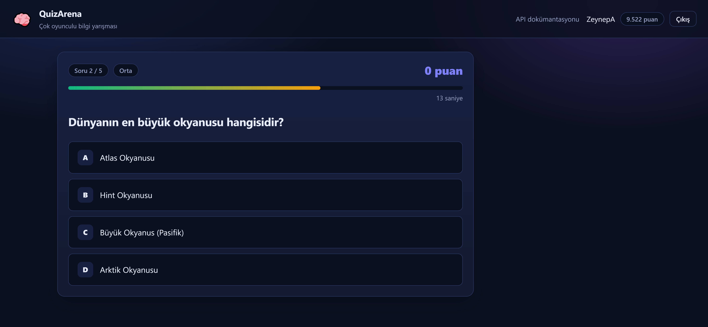
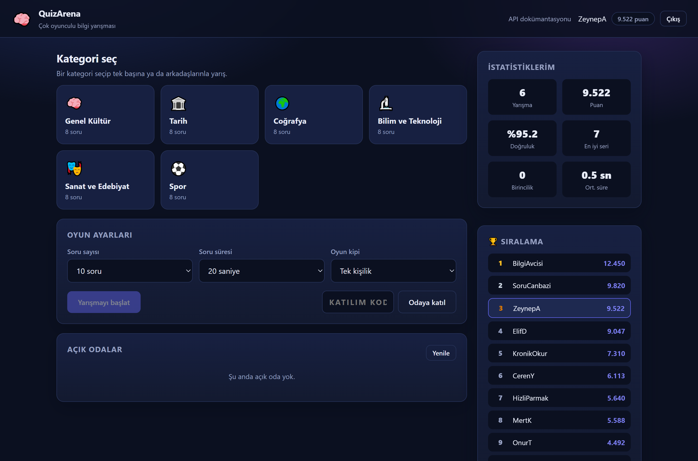
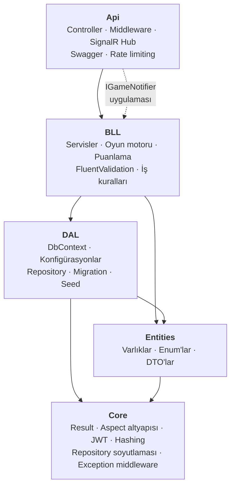
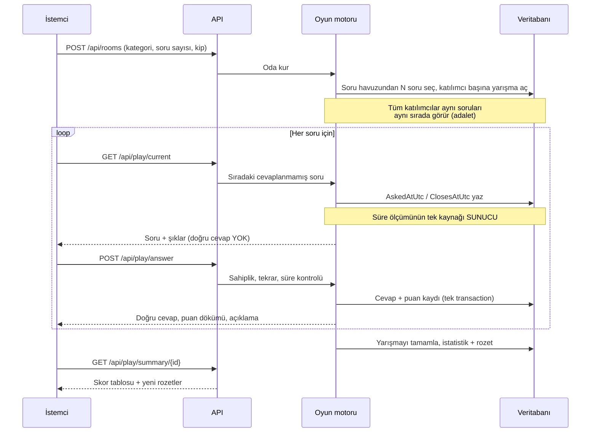
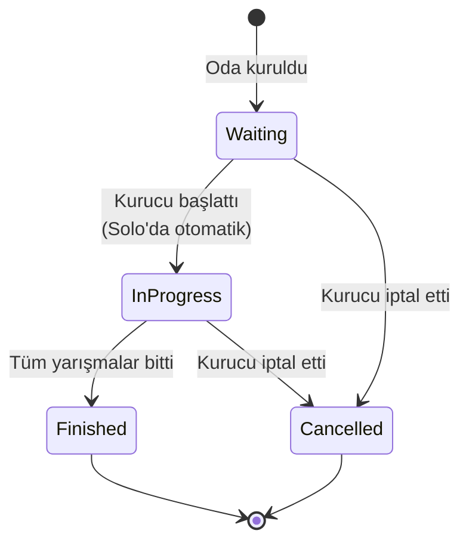

<div align="center">

# 🧠 QuizArena

**Katmanlı .NET 8 mimarisi üzerine kurulmuş çok oyunculu bilgi yarışması platformu.**

Gerçek zamanlı odalar · sunucu otoriteli puanlama · tasarımdan gelen hile direnci

[](https://dotnet.microsoft.com/)
[](https://learn.microsoft.com/ef/core/)
[](https://www.microsoft.com/sql-server)
[](https://learn.microsoft.com/aspnet/core/signalr/)
[](#testler)
[](#)
[](LICENSE)

[English](README.md) · **Türkçe**

</div>

---

<div align="center">
  
</div>

**Tek komutla çalışan bir bilgi yarışması.** Depoyu al, `dotnet run` de, tarayıcıda
oynamaya başla — npm yok, derleme adımı yok, CDN yok. Oynanabilir istemci
`wwwroot` içinde, düz HTML, CSS ve JavaScript olarak geliyor.

Okumaya değer kılan üç şey:

- **Doğru cevap tarayıcıya hiç ulaşmıyor.** Ne soru yanıtında, ne gizli bir
  alanda, ne de ikinci bir uçta. Yalnızca sen cevapladıktan sonra geliyor.
- **Süreyi sunucu tutuyor.** Geçen zaman, sorunun sunulduğu yerde ölçülüyor;
  donmuş bir sekme ya da değiştirilmiş sistem saati hiçbir şey kazandırmıyor.
- **Puanlama hızı ve zorluğu birlikte ödüllendiriyor**; formülün tamamı saf bir
  fonksiyon ve kendi test kümesi var — bütün sınır değerleri kapsanmış.

<div align="center">
  
</div>

> Ekran görüntüleri paketteki demo verisinden alındı; sayılar örnektir.
> Aşağıdaki her sertleştirme kararı, değiştirdiği ayarla değil **kapattığı
> saldırıyla** birlikte belgelenmiştir; ayrıntısı
> [güvenlik bölümünde](#güvenlik).

---

## İçindekiler

- [Hızlı başlangıç](#hızlı-başlangıç)
- [Mimari](#mimari)
- [Oyun akışı](#oyun-akışı)
- [Güvenlik](#güvenlik)
- [Puanlama](#puanlama)
- [API uçları](#api-uçları)
- [Testler](#testler)
- [Yapılandırma](#yapılandırma)
- [Docker](#docker)
- [Teknik kararlar](#teknik-kararlar)

---

## Hızlı başlangıç

**Gereksinimler:** .NET 8 SDK ve bir SQL Server örneği
(LocalDB, SQL Express veya Docker).

```bash
git clone https://github.com/kbycode/QuizArena.git
cd QuizArena/QuizArena
```

JWT imza anahtarı **kaynak kodda bulunmaz**; bir kez tanımlamanız gerekir:

```bash
dotnet user-secrets set "TokenOptions:SecurityKey" "en-az-32-karakterlik-rastgele-bir-anahtar" --project QuizArena.Api
```

Ardından çalıştırın:

```bash
dotnet run --project QuizArena.Api --launch-profile http
```

Uygulama açılışta veritabanı şemasını oluşturur ve **6 kategori + 48 soru**,
4 yetki tanımı, 6 rozet ve sıralama tablosu için örnek oyuncular ekler.

| Adres | Ne var? |
|---|---|
| <http://localhost:5219> | Oynanabilir demo arayüzü |
| <http://localhost:5219/swagger> | API dokümantasyonu (Swagger UI) |
| <http://localhost:5219/health/ready> | Sağlık kontrolü |

> **Yönetici hesabı:** Parola `Seed:AdminPassword` ile verilmezse, geliştirme
> ortamında rastgele üretilip **açılış logunda bir kez** gösterilir. Üretim
> ortamında parola verilmemişse yönetici hesabı **hiç oluşturulmaz** — tahmin
> edilebilir bir yönetici parolasıyla yayına çıkmak imkânsızdır.

---

## Mimari

Bağımlılıklar **tek yön**e akar. Hiçbir alt katman üstünü tanımaz:



| Katman | Sorumluluk | Bilmediği şey |
|---|---|---|
| **Core** | Teknik altyapı: sonuç tipleri, AOP, güvenlik, sayfalama, hata yönetimi | Yarışma, oda, soru — hiçbir iş kavramı |
| **Entities** | Alan modeli ve veri taşıyıcıları | Veritabanı, HTTP |
| **DAL** | "Veriyi nasıl saklıyoruz?" | İş kuralları |
| **BLL** | "Kurallar ne?" — uygulamanın beyni | HTTP, JSON, SignalR |
| **Api** | "Dışarıya nasıl açıyoruz?" | SQL, veri modeli ayrıntıları |

### Dikkate değer sınır: `IGameNotifier`

Gerçek zamanlı bildirimler SignalR ile yapılır, ancak iş katmanı SignalR'ı
**tanımaz**. `BLL` yalnızca `IGameNotifier` arayüzünü bilir; SignalR uygulaması
(`SignalRGameNotifier`) API katmanındadır. Böylece:

- iş kuralları birim testinde `IHubContext` taklit etmeye gerek kalmadan çalışır,
- bildirim teknolojisi değişirse iş kuralları değişmez,
- bildirim altyapısı hiç kaydedilmezse `NullGameNotifier` devreye girer ve oyun
  akışı bozulmadan sürer.

---

## Oyun akışı



### Oda durumları



---

## Güvenlik

Bu projede güvenlik sonradan eklenmiş bir katman değil, veri modeliyle birlikte
tasarlanmış bir kısıt kümesidir.

### Doğru cevap istemciye asla gitmez

Soru servis edilirken kullanılan `QuizQuestionResponse` ve `QuizOptionResponse`
tiplerinde "doğru mu?" diye bir alan **tanımlı değildir**. Yani yanlış bir DTO
seçilse bile doğru cevap sızamaz — koruma bir `if` kontrolüne değil **tip
sistemine** bağlanmıştır. Doğru cevap ancak oyuncu tercihini gönderdikten sonra
`AnswerResultResponse` ile açıklanır.

### Süreyi sunucu ölçer

`POST /api/play/answer` isteğinde "kaç saniyede cevapladım" alanı **yoktur**.
Sunucu, soruyu sunduğu anı (`AskedAtUtc`) kendisi yazar ve süreyi kendisi
hesaplar. Ağ gecikmesi için 1,5 saniyelik tolerans tanınır.

### Kritik kurallar veritabanı kısıtlarında

| Kısıt | Engellediği saldırı |
|---|---|
| `CompetitionAnswers.CompetitionQuestionId` **tekil** | Aynı soruya ikinci cevap gönderip puan katlama (eşzamanlı istekler dahil) |
| `(CompetitionId, QuestionId)` **tekil** | Aynı sorunun bir yarışmada tekrarı |
| `(RoomId, UserId)` **tekil** | Aynı kullanıcının odada iki kez görünmesi |
| `Users.NormalizedEmail` **tekil** | "Kontrol et → ekle" arasındaki yarış koşulu |
| `(UserId, AchievementId)` **tekil** | Aynı rozetin ödül puanını tekrar tekrar kazanma |

### Kimlik doğrulama

- **PBKDF2-HMAC-SHA256**, 600.000 tur (OWASP 2023), rastgele tuz, parametreler
  özetin içinde saklanır → tur sayısı ileride artırılabilir, mevcut kullanıcılar
  etkilenmez (`SuccessRehashNeeded` → sessiz yeniden özetleme).
- Sabit zamanlı karşılaştırma (`CryptographicOperations.FixedTimeEquals`).
- Kullanıcı olmasa bile parola doğrulama maliyeti ödenir → yanıt süresinden
  hesabın varlığı anlaşılamaz.
- 15 dakikalık erişim jetonu + **rotasyonlu** refresh token. Jeton yeniden
  kullanımı tespit edilirse kullanıcının **tüm** oturumları düşer.
- Refresh token'lar veritabanında **SHA-256 özeti** olarak tutulur.
- 5 hatalı denemeden sonra 15 dakika hesap kilidi.
- Kimlik doğrulama uçlarında ayrı ve sıkı hız sınırı (dakikada 10 istek).

### Katmanlı yetkilendirme

Controller'daki `[Authorize]`'a ek olarak iş metotlarında
`[SecuredOperationAspect(...)]` bulunur. Amaç: yarın aynı servisi çağıran yeni
bir giriş noktası (SignalR hub'ı, arka plan görevi, yeni controller) eklenip
yetki niteliği unutulduğunda korumanın devrede kalması.

---

## Puanlama

```
Taban       = zorluk        (Kolay 100 · Orta 150 · Zor 250)
Hız bonusu  = Taban × 0,5 × (kalan süre oranı)
Seri bonusu = min(mevcut seri, 10) × 10
─────────────────────────────────────────────
Toplam      = Taban + Hız + Seri      (yanlış/süre dolduysa 0)
```

Hesaplama `ScoreCalculator` içinde **saf (pure)** bir fonksiyondur: veritabanı,
saat veya HTTP bağlamı kullanmaz. Bu yüzden formülün tamamı birim testleriyle
kapatılmıştır ve "bazen farklı puan verdi" durumu imkânsızdır.

**Rozetler:** İlk Adım · Kusursuz · Şimşek · Kıdemli · Seri Katil · Şampiyon

---

## API uçları

| Yöntem | Uç | Yetki | Açıklama |
|---|---|---|---|
| `POST` | `/api/auth/register` | — | Kayıt + oturum |
| `POST` | `/api/auth/login` | — | Giriş |
| `POST` | `/api/auth/refresh` | — | Jeton yenileme (rotasyonlu) |
| `POST` | `/api/auth/logout` | — | Jeton iptali |
| `POST` | `/api/auth/change-password` | Oturum | Parola değiştir + tüm oturumları kapat |
| `GET` | `/api/categories` | — | Kategoriler (soru sayılarıyla) |
| `GET` | `/api/leaderboard` | — | Sıralama tablosu |
| `GET` | `/api/users/me` | Oturum | Kendi profili |
| `PUT` | `/api/users/me` | Oturum | Profil güncelle |
| `GET` | `/api/users/me/statistics` | Oturum | İstatistik + rozetler |
| `GET` | `/api/users` | `User.Manage` | Kullanıcı listesi (sayfalı) |
| `POST` | `/api/rooms` | Oturum | Oda kur |
| `POST` | `/api/rooms/join` | Oturum | Katılım koduyla katıl |
| `POST` | `/api/rooms/{id}/start` | Kurucu | Yarışmayı başlat |
| `GET` | `/api/play/current` | Oturum | Sıradaki soru |
| `POST` | `/api/play/answer` | Oturum | Cevap gönder |
| `GET` | `/api/play/summary/{id}` | Oturum | Sonuç ekranı |
| `GET`/`POST`/`PUT`/`DELETE` | `/api/questions` | `Question.Manage` | Soru yönetimi |
| `GET`/`POST`/`PUT`/`DELETE` | `/api/categories` | `Category.Manage` | Kategori yönetimi |
| `*` | `/api/operationclaims` | `Admin` | Yetki yönetimi |

Tam liste ve şemalar için Swagger arayüzüne bakın.

**Gerçek zamanlı kanal:** `/hubs/quiz` (SignalR) — `RoomUpdated`, `GameStarted`,
`ScoreboardUpdated`, `GameFinished`, `RoomCancelled` olayları.

---

## Testler

```bash
dotnet test
```

**103 test.** Kapsam:

| Alan | Ne doğrulanıyor? |
|---|---|
| `ScoreCalculatorTests` | Puanlama formülünün her kalemi, sıfıra bölme, sınır değerler |
| `Pbkdf2PasswordHasherTests` | Özetleme, bozuk kayıt dayanıklılığı, yeniden özetleme, zamanlama |
| `JwtTokenServiceTests` | Claim'ler, UTC ömür hesabı, jeton tekilliği |
| `GameFlowTests` | **Uçtan uca oyun akışı** — gerçek repository + SQLite |
| `ValidatorTests` | Parola politikası, soru/oda kuralları |
| `UtilityTests` | Türkçe slug, katılım kodu, sıralı GUID, sayfalama sınırları |

`GameFlowTests` sahte repository kullanmaz; **SQLite (bellek içi)** üzerinde
gerçek EF Core ile çalışır. Sebebi: bu projedeki en kritik güvenceler tekil
indekslere dayanıyor ve EF Core'un `InMemory` sağlayıcısı ilişkisel kısıtları
uygulamaz — onunla test etmek, o güvenceleri test etmemek olurdu.

Hile senaryoları da testlidir: başkasının sorusuna cevap (IDOR), aynı soruya
ikinci cevap, sunulmamış soruyu cevaplama, süre aşımı, başka soruya ait şık.

---

## Yapılandırma

| Ayar | Ortam değişkeni | Varsayılan |
|---|---|---|
| Bağlantı dizesi | `ConnectionStrings__QuizArena` | LocalDB |
| JWT imza anahtarı | `TokenOptions__SecurityKey` | **yok — zorunlu** |
| Erişim jetonu ömrü | `TokenOptions__AccessTokenExpirationMinutes` | 15 dk |
| Refresh token ömrü | `TokenOptions__RefreshTokenExpirationDays` | 7 gün |
| İzinli CORS kaynakları | `Cors__AllowedOrigins__0` | localhost |
| Yönetici parolası | `Seed__AdminPassword` | yok (bkz. yukarı) |
| Genel hız sınırı | `RateLimiting__GeneralPermitPerMinute` | 120/dk |

`TokenOptions` ayarları `ValidateOnStart()` ile doğrulanır: anahtar eksik veya
32 karakterden kısaysa uygulama **ilk istek gelmeden, açılışta** durur.
"Secret unutuldu, üretimde zayıf anahtarla çalışıyor" sınıfı hatalar yapısal
olarak imkânsızdır.

---

## Docker

```bash
docker compose up --build
```

`docker-compose.yml`, SQL Server 2022 ile API'yi birlikte ayağa kaldırır.
Uygulama <http://localhost:8080> adresinde çalışır.

---

## Teknik kararlar

Aşağıdaki kararların hepsi ilgili dosyada gerekçesiyle birlikte belgelenmiştir.

**Autofac + Castle DynamicProxy neden?** Yerleşik DI konteyneri metot kesme
(interception) desteklemez. `[ValidationAspect]`, `[CacheAspect]`,
`[TransactionAspect]`, `[SecuredOperationAspect]`, `[LogAspect]`,
`[PerformanceAspect]` niteliklerinin çalışması için servis arayüzüne vekil
(proxy) üretilmesi gerekir. Autofac yalnızca iş servisleri için devrededir;
altyapı yerleşik konteynerde kalır.

**Aspect altyapısı neden yeniden yazıldı?** Yaygın örneklerde her aspect kendi
`IInterceptor`'ı olur ve bağımlılıklarını statik bir servis bulucudan çeker;
ayrıca `OnSuccess` kancası `Task` tamamlanmadan tetiklendiği için asenkron
metotlarda **önbelleğe henüz üretilmemiş sonuç yazılır**. Buradaki tek kesici
(`AspectInterceptor`) normal DI ile kurulur, `IServiceProvider`'ı aspect'lere
bağlam içinde geçirir ve `Task`/`Task<T>` sonuçlarını gerçekten `await` eder.

**AutoMapper neden yok?** Bu projenin en kritik kuralı "doğru cevap ve parola
özeti istemciye sızmayacak". Yansımayla otomatik eşleme yapan bir kütüphanede
yeni bir alan eklendiğinde sessizce yanıta girebilir. Elle yazılan eşlemede bir
alanın yanıta girmesi için birinin onu bilinçle yazması gerekir; DTO'ya alan
eklenince kod derlenmez.

**Rastgele soru seçimi neden SQL'de yapılmıyor?** SQL Server'da
`ORDER BY NEWID()` tüm tabloyu tarayıp sıralamaya zorlar; `RAND()` ise bir
sorguda tüm satırlar için aynı değeri üretir (yani karıştırmaz). Sağlayıcıya
özgü SQL yazmak da SQLite ile çalışan testleri kırar. Bu yüzden yalnızca
kimlikler çekilip karıştırma iş katmanında, kriptografik rastgelelikle yapılır.

**`EnableRetryOnFailure` neden kapalı?** EF Core'un yeniden deneme stratejisi,
elle başlatılan transaction'ları desteklemez. Bu projede transaction sınırını
`[TransactionAspect]` yönetiyor ve çok adımlı işlemlerin atomikliği geçici hata
dayanıklılığından daha kritik. İkisini birlikte açmak, üretimde ilk
transaction'da patlayan bir uygulama demek olurdu.

**Demo arayüzünde neden SignalR yok?** SignalR JavaScript istemcisi ya CDN'den
ya npm derlemesinden gelmek zorunda; ikisi de projeyi "`dotnet run` ile hemen
çalışır" olmaktan çıkarır ve sıkı `Content-Security-Policy` başlığını ihlal
eder. Demo aynı sonucu kısa aralıklı yoklamayla üretir; hub gerçek istemciler
için hazırdır.

**`Serilog` istek logu neden en dışta?** Hata yöneticisinin içinde kalırsa,
istisna Serilog'dan geçerken yanıt durum kodu henüz belirlenmemiştir ve log
"500" yazar. İstemci 404 alsa bile loglar 500 dolu görünür; hata panoları
uydurma sunucu hatalarıyla kirlenir.

---

## Proje yapısı

```
QuizArena/
├── .editorconfig                  · Kod stili + üretilmiş kod muafiyeti
├── .github/workflows/ci.yml       · Derle, test et, güvenlik denetimi
├── docker-compose.yml
├── Dockerfile
└── QuizArena/
    ├── Directory.Build.props       · Ortak derleme ayarları, analiz kuralları
    ├── Directory.Packages.props    · Merkezî paket sürümleri + transitive pinning
    ├── QuizArena.Core/        · Altyapı (iş kuralı bilmez)
    │   ├── Aspects/                · AOP: doğrulama, önbellek, transaction, yetki, log
    │   ├── DataAccess/             · Repository soyutlaması, sayfalama, UnitOfWork
    │   ├── Middleware/             · RFC 7807 hata yönetimi
    │   └── Utilities/              · Result, JWT, hashing, saat, sıralı GUID
    ├── QuizArena.Entities/    · Varlıklar, enum'lar, DTO'lar
    ├── QuizArena.DAL/         · DbContext, konfigürasyonlar, repolar, migration, seed
    ├── QuizArena.BLL/         · Servisler, oyun motoru, puanlama, doğrulama
    ├── QuizArena.Api/         · Controller, middleware, SignalR, demo arayüz
    └── QuizArena.Tests/       · 103 test (xUnit + FluentAssertions + SQLite)
```

---

## Lisans

[MIT Lisansı](LICENSE) ile yayımlanmıştır.
